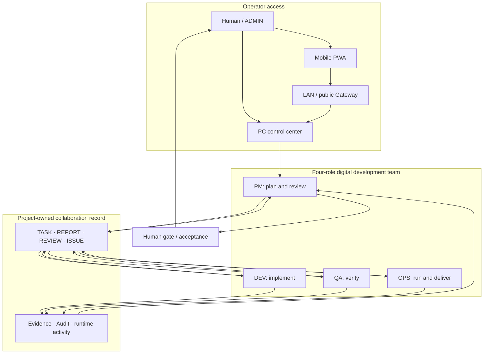
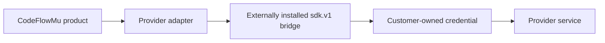

# CodeFlowMu Public Architecture and Trust Boundaries

> This is the unified architecture entry point for the distribution repository. It first explains the public TMPA–FCoP–CodeFlowMu relationship, then documents the current CodeFlowMu Distribution product and trust boundaries. It does not disclose private implementation topology or make a new version-conformance or certification claim.

[中文](ARCHITECTURE.zh-CN.md)


## 1. Architecture position

> **TMPA defines theory and specification; FCoP provides a tool-executable, file-based collaboration and evidence protocol; CodeFlowMu performs Agent programming, fact production and governance consumption.**

| System | Public position | Primary responsibility | Explicitly not |
| --- | --- | --- | --- |
| **TMPA** | Theory and normative governance layer | Define governance objects, role/action relationships, Reader semantics and conformance criteria | An Agent Runtime or tool host |
| **FCoP** | File-based collaboration and evidence protocol | Define TASK, REPORT, REVIEW, ISSUE, Lifecycle, references and tool entry points | The CodeFlowMu runtime body or live-state store |
| **CodeFlowMu** | Agent programming engineering Runtime | Assemble Agent capabilities, perform real engineering work, maintain delivery and recovery order, and produce and consume governance evidence | A rename of TMPA or FCoP |

Together they form a continuous path from theory through protocol to engineering execution. They are not three internal modules of one application and cannot substitute for one another.

### TMPA: theory and specification

TMPA (Textual Multi-Agent Process Architecture) defines governance facts, responsibility relationships, lifecycle semantics, Reader aggregation behavior and Core conformance criteria. It requires conflicts, uncertainty, rejection, isolation and evidence boundaries to be preserved rather than overwritten by model inference.

TMPA does not dispatch Agents, invoke engineering tools or replace business acceptance.

### FCoP: a tool-oriented protocol

FCoP carries multi-Agent collaboration and evidence in project-visible files. Typical objects include TASK, REPORT, REVIEW, ISSUE and Lifecycle. It provides a PyPI SDK, MCP Tools and reference implementations, so Agents can use it directly as a tool-executable protocol.

Tools are engineering entry points to the protocol, not the whole protocol definition. Tool counts may evolve and do not define the protocol boundary. Keeping the protocol focused does not mean abandoning useful existing tools: tools can continue while they remain effective, maintainable and protocol-serving.

FCoP is not the CodeFlowMu runtime body and does not own CodeFlowMu live sessions, dispatch or execution state.

### CodeFlowMu: engineering Runtime

CodeFlowMu receives human goals and business authorization, binds tasks, roles and context to Agents, assembles Hosts, models, Skills, MCP, FCoP and local engineering tools, maintains execution, delivery, recovery and audit order, and uses governance results in project views, workflows, Review, Recovery and Audit.

CodeFlowMu is a downstream adopter of FCoP and one engineering reference environment for TMPA theory and specification. It does not redefine TMPA or FCoP.

## 2. Definition and adoption relation

```text
TMPA Architecture Paper A1.0
        ↓ supplies architecture theory and design direction
TMPA Core Specification S1.0
        ↓ fixes governance objects, Reader behavior and conformance rules
FCoP
        ↓ supplies a file-based collaboration and evidence Profile
CodeFlowMu
        ↓ produces runtime facts and consumes governance results
Project views / Workflow / Review / Recovery / Audit
```

This relation expresses definition and adoption direction. It does not mean TMPA and FCoP are ordinary internal CodeFlowMu modules. Engineering practice can feed back into theory and protocol development, but an engineering outcome does not automatically become theoretical proof.

## 3. Public CodeFlowMu composition

> **CodeFlowMu = Runtime Foundation + Execution Slots + Capability Bus**

### 3.1 Runtime Foundation

The Runtime Foundation provides deterministic engineering order: task identity and lifecycle, persistent facts and state consistency, dispatch and delivery, interruption recovery, work evidence, audit and human-approval interfaces. It can reject illegal or under-evidenced state changes, but it does not infer business decisions from model language.

### 3.2 Execution Slots

Execution Slots are the adaptation boundary between the Runtime and Agent Hosts. They carry Agent sessions, task context, tool/action bridges, and result, error and evidence return. Specific Provider and Host capabilities are governed by the corresponding release documentation; changing a Host must not change the top-level TMPA, FCoP and CodeFlowMu boundaries.

### 3.3 Capability Bus

The Capability Bus assembles Host-native engineering tools, FCoP protocol tools, MCP services, Skills, Playbooks, external systems and workspace capabilities. An Agent sees only capabilities allowed by its current role, task and authorization.

Connecting a tool to CodeFlowMu does not give that tool ownership of Runtime facts. MCP is a capability connection mechanism; it does not mean every MCP tool belongs to FCoP.

### 3.4 Deterministic Work Rail

The “rail” is the Runtime's deterministic constraint over task identity, state, evidence, delivery and recovery paths. Model Agents may reason autonomously and select implementation paths, but formal state changes, result delivery, evidence and human authorization must cross inspectable engineering boundaries.

CodeFlowMu can therefore be understood as an engineering rail machine for Agent programming: it does not think instead of the Agent; it makes Agent work persistent, recoverable, verifiable, handoff-ready and auditable.

## 4. Governed Agent work loop

```text
Work Context
  → Reason & Plan
  → Select Capability
  → Execute & Verify
  → Evidence & Handoff
  → Governance Feedback
  → Next Work Context
```

- The Agent understands, plans, selects capabilities and acts.
- Hosts and tools provide real engineering action.
- The Runtime maintains task identity, state, delivery and recovery order.
- FCoP preserves collaboration evidence that must cross Agents, sessions and roles.
- The TMPA Reader reconstructs governance views.
- Humans and authorized roles retain business acceptance and final decision authority.

## 5. Evidence and governance loop

```text
CodeFlowMu Work Actions
        ↓ publish persistent collaboration artifacts
FCoP Collaboration Evidence
        ↓ read-only aggregation and adaptation
TMPA Governance Reconstruction
        ↓ produce governance views
CodeFlowMu Governance Use
        ↓
Project views / Workflow / Review / Recovery / Audit / Human Approval
```

| Fact plane | Public definition | Must not be confused with |
| --- | --- | --- |
| CodeFlowMu Runtime facts | Facts needed for current work execution, delivery and recovery | FCoP protocol definitions or TMPA theoretical conclusions |
| FCoP collaboration evidence | Project-visible task, report, review, issue and lifecycle artifacts | Live session state or business truth |
| TMPA reconstructed governance view | Objects, relationships, judgments and issues reconstructed by a Reader from candidate evidence | Agent dispatch, business acceptance or runtime-state writes |

FCoP evidence can prove that an object or claim was published, referenced and transferred; it does not automatically prove the claim true. The TMPA Reader is a read-only governance path. It does not mutate CodeFlowMu runtime state or replace PM, QA, ADMIN or human business decisions.

## 6. Current product scope

CodeFlowMu currently packages one specific operating model: a human-supervised digital software development team with four persistent roles—PM, DEV, QA and OPS. The “digital employee development machine” is a future direction and is not part of the current product contract.

## 7. Current product control and collaboration plane



The PC control center is the primary administration surface. The PWA is a remote entry point and requires a running, bound PC instance. Project tasks and evidence belong to the registered business project, not to the protected application installation directory.

## 8. Runtime and Provider boundary



- The Windows installer bundles pinned base Node.js and Python runtimes.
- The real Cursor SDK/bridge is not redistributed inside the main installer.
- Provider versions are installed under product data, not Program Files, and can be upgraded or rolled back independently.
- A Provider becomes formally supported only after the exact bridge, archive hash and installed CodeFlowMu version pass the compatibility gate and publish `cursor.json` evidence.
- Candidate 1 does not include that formal compatibility evidence and must remain labeled pre-release.

## 9. Data and authority boundaries

| Boundary | Rule |
| --- | --- |
| Application | Built product files live under Program Files and are replaceable during upgrade. |
| Customer data | Projects, tasks, reports, evidence, audit and Provider state are mutable data and must remain outside the installed program tree. |
| Credentials | API keys and bind links are customer secrets. They must not be committed, attached to issues or embedded in product manifests. |
| Agent authority | Roles operate only within configured projects and authorized tools. Sensitive actions and acceptance remain human-controlled. |
| Mobile access | A phone binds to one PC Runtime instance through LAN or Gateway state; lost or retired devices should be revoked. |
| Distribution | This repository contains documentation and release evidence. Product source and development history stay in a separate private repository. |

## 10. Release topology

```text
verified private source commit
→ closed-distribution boundary
→ built Windows product
→ installer and installed-file verification
→ effective security review
→ Provider compatibility evidence
→ immutable release in CodeFlowMu-Distribution
```

Pre-release candidates may be published for evaluation while a formal gate is still blocked, but the blocked gate must be prominent in both the Release notes and the product documentation.

## 11. Roadmap boundary

The future “digital employee development machine” may add reusable employee-package production, testing, assembly and upgrade workflows. Those concepts are intentionally excluded from the diagrams above until they ship and acquire their own evidence, compatibility and lifecycle contracts.

## 12. Version, conformance and publication boundary

The overall architecture uses the public A1.0, S1.0 and I1.0 terminology, but this document is not a new conformance report. Current Distribution roles, interfaces, Providers, installation, mobile access, compatibility and release gates are governed by the README, the corresponding Release notes and fixed evidence.

This document and diagram alone cannot claim TMPA certification, independent validation, business truth, elimination of model hallucination, or S1.0 conformance for any product version not covered by fixed evidence.

The public architecture diagram excludes private source versions, unreleased candidate status, Provider lists, exact tool counts, internal class names and call chains, local source paths, ports, credentials, runtime history, customer data and private release infrastructure.

## 13. Public sources

- [Digital Employee Works](https://joinwell52-ai.github.io/joinwell52/zh/)
- [TMPA Architecture Paper A1.0](https://joinwell52-ai.github.io/joinwell52/zh/publications/tmpa-architecture-paper-a1.0)
- [TMPA Core Specification S1.0](https://joinwell52-ai.github.io/joinwell52/zh/publications/tmpa-core-specification-s1.0)
- [TMPA–FCoP–CodeFlowMu Implementation Case I1.0](https://joinwell52-ai.github.io/joinwell52/zh/publications/implementation-case-i1.0)
- [FCoP Official Site](https://joinwell52-ai.github.io/FCoP/)
- [CodeFlowMu Open](https://github.com/joinwell52-AI/CodeFlowMu-open)
