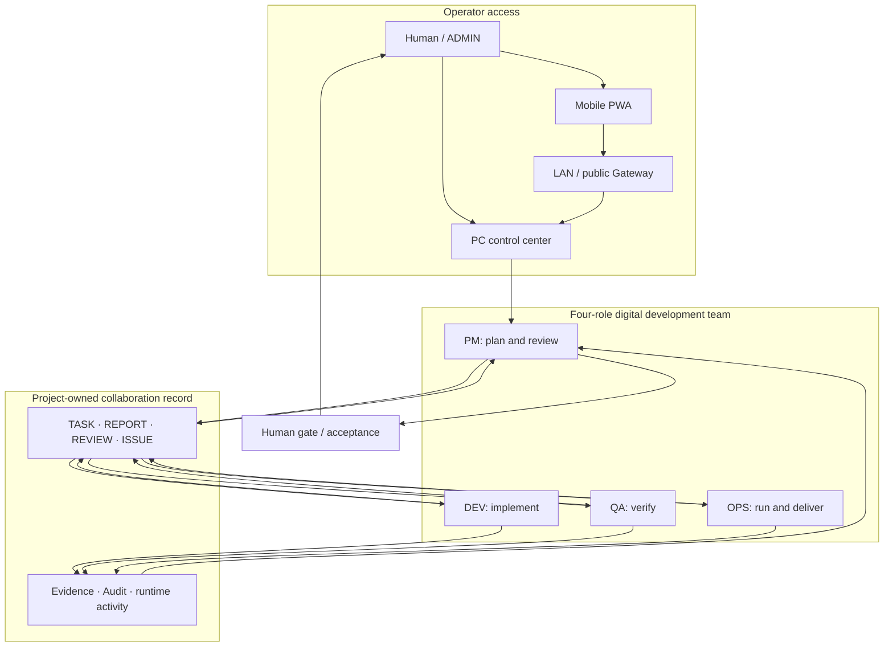
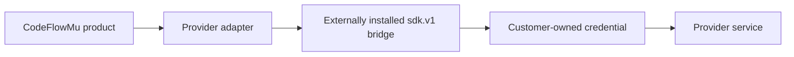

# CodeFlowMu Architecture and Trust Boundaries

## Product scope

CodeFlowMu currently packages one specific operating model: a human-supervised digital software development team with four persistent roles—PM, DEV, QA and OPS. The “digital employee development machine” is a future direction and is not part of the current product contract.

## Control and collaboration plane



The PC control center is the primary administration surface. The PWA is a remote entry point and requires a running, bound PC instance. Project tasks and evidence belong to the registered business project, not to the protected application installation directory.

## Runtime and Provider boundary



- The Windows installer bundles pinned base Node.js and Python runtimes.
- The real Cursor SDK/bridge is not redistributed inside the main installer.
- Provider versions are installed under product data, not Program Files, and can be upgraded or rolled back independently.
- A Provider becomes formally supported only after the exact bridge, archive hash and installed CodeFlowMu version pass the compatibility gate and publish `cursor.json` evidence.
- Candidate 1 does not include that formal compatibility evidence and must remain labeled pre-release.

## Data and authority boundaries

| Boundary | Rule |
| --- | --- |
| Application | Built product files live under Program Files and are replaceable during upgrade. |
| Customer data | Projects, tasks, reports, evidence, audit and Provider state are mutable data and must remain outside the installed program tree. |
| Credentials | API keys and bind links are customer secrets. They must not be committed, attached to issues or embedded in product manifests. |
| Agent authority | Roles operate only within configured projects and authorized tools. Sensitive actions and acceptance remain human-controlled. |
| Mobile access | A phone binds to one PC Runtime instance through LAN or Gateway state; lost or retired devices should be revoked. |
| Distribution | This repository contains documentation and release evidence. Product source and development history stay in a separate private repository. |

## Release topology

```text
verified private source commit
→ closed-distribution boundary
→ built Windows product
→ installer and installed-file verification
→ effective security review
→ Provider compatibility evidence
→ immutable release in CodeFlowMu-Distribution
```

Pre-release candidates may be published for evaluation while a formal gate is still blocked, but the blocked gate must be prominent in both the Release notes and the product documentation.

## Roadmap boundary

The future “digital employee development machine” may add reusable employee-package production, testing, assembly and upgrade workflows. Those concepts are intentionally excluded from the diagrams above until they ship and acquire their own evidence, compatibility and lifecycle contracts.
