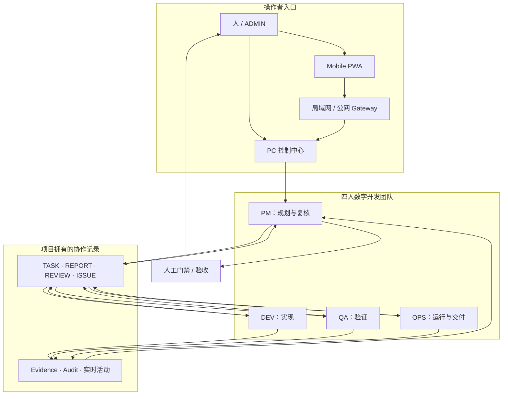
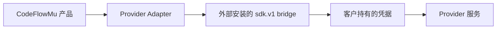

# CodeFlowMu 公开架构与信任边界

> 本文是发行仓库的统一架构入口：先说明 TMPA–FCoP–CodeFlowMu 的公开总体关系，再说明当前 CodeFlowMu Distribution 的产品实现与信任边界。本文不公开私有实现拓扑，也不构成新的版本符合性或认证声明。

[English](ARCHITECTURE.md)


## 1. 架构定位

> **TMPA 定义理论与规范；FCoP 提供可由工具执行的文件型协作与证据协议；CodeFlowMu 负责 Agent 编程运行、事实生产与治理消费。**

| 系统 | 公开定位 | 主要职责 | 明确不是什么 |
| --- | --- | --- | --- |
| **TMPA** | 理论与规范治理层 | 定义治理对象、角色与动作关系、Reader 语义和符合性准则 | Agent Runtime 或工具宿主 |
| **FCoP** | 文件型协作与证据协议 | 定义 TASK、REPORT、REVIEW、ISSUE、Lifecycle、引用关系和工具入口 | CodeFlowMu 运行体或实时状态存储 |
| **CodeFlowMu** | Agent 编程工程 Runtime | 装配 Agent 能力，执行真实工程工作，维护交付与恢复秩序，产生并消费治理证据 | TMPA 或 FCoP 的改名 |

三者构成从理论、协议到工程运行的连续体系，但不是同一个软件的三个内部模块，也不能互相替代。

### TMPA：理论与规范

TMPA（Textual Multi-Agent Process Architecture，文本化多智能体流程架构）定义治理事实、责任关系、生命周期、Reader 聚合行为和 Core 符合性准则。它要求冲突、不确定、拒绝、隔离和证据边界被保留，而不是被模型推测覆盖。

TMPA 不调度 Agent，不调用工程工具，也不替代业务验收。

### FCoP：工具型协议

FCoP 以项目可见文件承载多 Agent 协作和证据，典型对象包括 TASK、REPORT、REVIEW、ISSUE 与 Lifecycle。它提供 PyPI SDK、MCP Tools 和参考实现，因此属于可被 Agent 直接使用的工具型协议。

工具是协议的工程入口，不等于协议的全部定义。工具数量可以随实现演进，也不决定协议边界。协议保持聚焦不等于弃用已有工具：只要工具有效、可维护并服务于协议，就可以继续使用。

FCoP 不是 CodeFlowMu 的运行体，不拥有 CodeFlowMu 的实时会话、调度和执行状态。

### CodeFlowMu：工程 Runtime

CodeFlowMu 接受人类目标和业务授权，为 Agent 绑定任务、角色和上下文，装配 Host、模型、Skills、MCP、FCoP 与本地工程工具，维护运行、交付、恢复和审计秩序，并将治理结果用于项目视图、工作流、Review、Recovery 与 Audit。

CodeFlowMu 是 FCoP 的下游采用者，也是 TMPA 理论与规范的工程参考环境之一；它不重新定义 TMPA 或 FCoP。

## 2. 定义与采用关系

```text
TMPA Architecture Paper A1.0
        ↓ 提供架构理论与设计方向
TMPA Core Specification S1.0
        ↓ 固定治理对象、Reader 与符合性行为
FCoP
        ↓ 提供文件型协作与证据 Profile
CodeFlowMu
        ↓ 产生运行事实并消费治理结果
项目视图 / 工作流 / Review / Recovery / Audit
```

这条关系表示定义和采用方向，不表示 TMPA、FCoP 被打包进 CodeFlowMu 成为普通内部模块。工程实践可以向理论和协议提供反馈，但工程结果不会自动成为理论证明。

## 3. CodeFlowMu 的公开工程构成

> **CodeFlowMu = 运行底座 + 执行插槽 + 能力总线**

### 3.1 运行底座

运行底座提供确定性的工程秩序：任务身份与生命周期、持久事实与状态一致性、投递与交付、中断恢复、工作证据、审计和人工审批接口。底座可以拒绝不合法或证据不足的状态变化，但不会从模型语言中猜测业务决定。

### 3.2 执行插槽

执行插槽是 Runtime 与 Agent Host 之间的适配边界，承载 Agent 会话、任务上下文、工具与行动桥接，以及结果、错误和证据返回。具体 Provider 与 Host 能力以对应发行版本说明为准；更换 Host 不应改变 TMPA、FCoP 与 CodeFlowMu 的一级系统边界。

### 3.3 能力总线

能力总线统一装配 Host 原生工程工具、FCoP 协议工具、MCP 服务、Skills、Playbooks、外部系统和工作区能力。Agent 只能看到当前角色、任务和授权允许的能力。

工具接入 CodeFlowMu，不代表该工具拥有 Runtime 事实；MCP 是能力接入方式，也不表示所有 MCP 工具都属于 FCoP。

### 3.4 确定性工作轨道

“轨道”表示 Runtime 对任务身份、状态、证据、交付和恢复路径施加确定性约束。模型 Agent 可以自主推理和选择实现路径，但正式任务的状态变化、结果交付、证据和人工授权必须经过可检查的工程边界。

因此，CodeFlowMu 可以理解为一台面向 Agent 编程的工程“轨道机”：它不替 Agent 思考，而是让 Agent 的工作能够持续、恢复、验证、交接和审计。

## 4. 受治理的 Agent 工作闭环

```text
Work Context
  → Reason & Plan
  → Select Capability
  → Execute & Verify
  → Evidence & Handoff
  → Governance Feedback
  → Next Work Context
```

- Agent 负责理解、规划、选择能力和执行；
- Host 与工具提供真实工程行动能力；
- Runtime 维护任务身份、状态、交付和恢复秩序；
- FCoP 保存需要跨 Agent、跨会话和跨角色传递的协作证据；
- TMPA Reader 重建治理视图；
- 人类和被授权角色保留业务验收与最终裁决权。

## 5. 证据与治理闭环

```text
CodeFlowMu Work Actions
        ↓ 发布需要协作的持久工件
FCoP Collaboration Evidence
        ↓ 只读聚合与适配
TMPA Governance Reconstruction
        ↓ 输出治理视图
CodeFlowMu Governance Use
        ↓
项目视图 / 工作流 / Review / Recovery / Audit / Human Approval
```

| 事实面 | 公开定义 | 不应混同为 |
| --- | --- | --- |
| CodeFlowMu Runtime facts | 当前工作运行、交付和恢复所需的事实 | FCoP 协议定义或 TMPA 理论结论 |
| FCoP collaboration evidence | 项目可见的任务、报告、审阅、问题与生命周期工件 | 实时会话状态或业务真值 |
| TMPA reconstructed governance view | Reader 从候选证据重建的对象、关系、判断和问题 | Agent 调度、业务验收或运行状态写入 |

FCoP 证据能够证明对象或声明被发布、引用和流转，但不会自动证明声明内容是真实的。TMPA Reader 是只读治理路径，不修改 CodeFlowMu 运行状态，也不替代 PM、QA、ADMIN 或人类作业务决定。

## 6. 当前产品范围

CodeFlowMu 当前只承诺一个明确的工作模型：由人监督、包含 PM、DEV、QA、OPS 四个固定角色的数字软件开发团队。“数字员工开发机”是未来方向，不属于当前产品合同。

## 7. 当前产品的控制面与协作面



PC 控制中心是主要管理入口。PWA 只是远程入口，必须绑定一台正在运行的 PC 实例。项目任务和证据属于已注册的业务项目，不属于受保护的应用安装目录。

## 8. Runtime 与 Provider 边界



- Windows 安装器自带锁定版本的基础 Node.js 和 Python Runtime。
- 真实 Cursor SDK/bridge 不在主安装包内再分发。
- Provider 版本安装在产品数据目录而不是 Program Files，可独立升级或回滚。
- 只有确切 bridge、官方 archive 哈希与已安装 CodeFlowMu 版本通过兼容门禁，并发布 `cursor.json` 证据后，Provider 才能称为正式支持。
- Candidate 1 没有这份正式兼容证据，因此必须保持 pre-release 标识。

## 9. 数据与权限边界

| 边界 | 规则 |
| --- | --- |
| 应用程序 | 构建后的产品文件位于 Program Files，升级时可以整体替换。 |
| 客户数据 | 项目、任务、报告、证据、审计与 Provider 状态是可变数据，必须位于程序安装目录之外。 |
| 凭据 | API Key 和绑定链接属于客户秘密，不能提交到仓库、公开 Issue 或写入产品清单。 |
| Agent 权限 | 各角色只能在已配置项目和已授权工具内工作；敏感操作与最终验收由人控制。 |
| 移动访问 | 手机通过局域网或 Gateway 状态绑定一个 PC Runtime 实例；丢失或停用的设备应及时解除绑定。 |
| 产品发行 | 本仓库只保存公开文档与 Release 证据；产品源码和开发历史保留在独立私有仓库。 |

## 10. 发行拓扑

```text
已验证的私有源码提交
→ 闭源发行边界
→ Windows 产品构建
→ 安装器与安装后文件验证
→ 有效安全复核
→ Provider 兼容证据
→ CodeFlowMu-Distribution 不可变 Release
```

候选 pre-release 可以在某个正式门禁仍被阻断时用于评估，但阻断项必须同时在 Release 说明和产品文档中醒目标注。

## 11. 路线边界

未来“数字员工开发机”可能增加可复用数字员工包的生产、测试、装配和升级流程。在这些能力真实交付并具备自己的证据、兼容与生命周期合同之前，它们不会进入上面的当前架构图。

## 12. 版本、符合性与公开边界

总体架构使用 A1.0、S1.0 和 I1.0 的公开术语，但本文本身不是新的符合性报告。当前 Distribution 的角色、界面、Provider、安装方式、移动访问、兼容性和发布门禁，以 README、对应 Release 说明及固定证据为准。

不得仅凭本文或架构图声称获得 TMPA 认证、完成独立验证、证明业务真值、消除模型幻觉，或证明任何未被固定证据覆盖的产品版本符合 S1.0。

公开架构图不包含私有母体版本、未发布候选状态、Provider 清单、精确工具数量、内部类名与调用链、本地源码路径、端口、凭据、运行历史、客户数据或私有发布基础设施。

## 13. 公开来源

- [数字员工工场](https://joinwell52-ai.github.io/joinwell52/zh/)
- [TMPA Architecture Paper A1.0](https://joinwell52-ai.github.io/joinwell52/zh/publications/tmpa-architecture-paper-a1.0)
- [TMPA Core Specification S1.0](https://joinwell52-ai.github.io/joinwell52/zh/publications/tmpa-core-specification-s1.0)
- [TMPA–FCoP–CodeFlowMu Implementation Case I1.0](https://joinwell52-ai.github.io/joinwell52/zh/publications/implementation-case-i1.0)
- [FCoP Official Site](https://joinwell52-ai.github.io/FCoP/)
- [CodeFlowMu Open](https://github.com/joinwell52-AI/CodeFlowMu-open)
