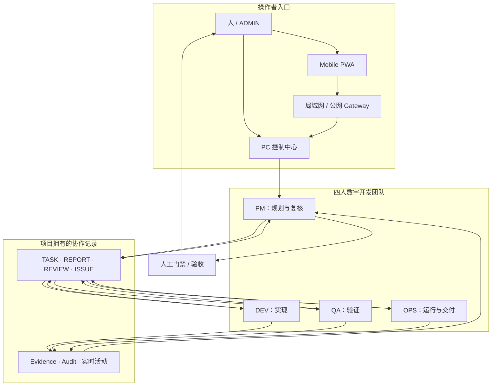
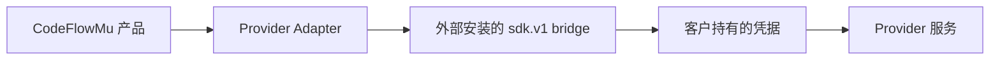

# CodeFlowMu 架构与信任边界

## 产品范围

CodeFlowMu 当前只承诺一个明确的工作模型：由人监督、包含 PM、DEV、QA、OPS 四个固定角色的数字软件开发团队。“数字员工开发机”是未来方向，不属于当前产品合同。

## 控制面与协作面



PC 控制中心是主要管理入口。PWA 只是远程入口，必须绑定一台正在运行的 PC 实例。项目任务和证据属于已注册的业务项目，不属于受保护的应用安装目录。

## Runtime 与 Provider 边界



- Windows 安装器自带锁定版本的基础 Node.js 和 Python Runtime。
- 真实 Cursor SDK/bridge 不在主安装包内再分发。
- Provider 版本安装在产品数据目录而不是 Program Files，可独立升级或回滚。
- 只有确切 bridge、官方 archive 哈希与已安装 CodeFlowMu 版本通过兼容门禁，并发布 `cursor.json` 证据后，Provider 才能称为正式支持。
- Candidate 1 没有这份正式兼容证据，因此必须保持 pre-release 标识。

## 数据与权限边界

| 边界 | 规则 |
| --- | --- |
| 应用程序 | 构建后的产品文件位于 Program Files，升级时可以整体替换。 |
| 客户数据 | 项目、任务、报告、证据、审计与 Provider 状态是可变数据，必须位于程序安装目录之外。 |
| 凭据 | API Key 和绑定链接属于客户秘密，不能提交到仓库、公开 Issue 或写入产品清单。 |
| Agent 权限 | 各角色只能在已配置项目和已授权工具内工作；敏感操作与最终验收由人控制。 |
| 移动访问 | 手机通过局域网或 Gateway 状态绑定一个 PC Runtime 实例；丢失或停用的设备应及时解除绑定。 |
| 产品发行 | 本仓库只保存公开文档与 Release 证据；产品源码和开发历史保留在独立私有仓库。 |

## 发行拓扑

```text
已验证的私有源码提交
→ 闭源发行边界
→ Windows 产品构建
→ 安装器与安装后文件验证
→ 有效安全复核
→ Provider 兼容证据
→ CodeFlowMu-Distribution 不可变 Release
```

候选 pre-release 可以在某个正式门禁仍被阻断时用于评估，但阻断项必须同时在 Release 说明和产品文档中醒目标注。

## 路线边界

未来“数字员工开发机”可能增加可复用数字员工包的生产、测试、装配和升级流程。在这些能力真实交付并具备自己的证据、兼容与生命周期合同之前，它们不会进入上面的当前架构图。
