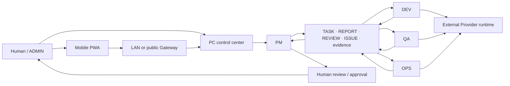

# CodeFlowMu

<p align="center">
  
</p>

<p align="center"><strong>Turn a software request into a visible, reviewable delivery with a local PM · DEV · QA · OPS digital development team.</strong></p>

<p align="center">Free public preview · Proprietary software · Windows x64 · Local-first control plane</p>

<p align="center">
  <a href="README.zh-CN.md">简体中文</a> ·
  <a href="#quickstart">Quickstart</a> ·
  <a href="https://github.com/joinwell52-AI/CodeflowMu-Distribution/releases">Downloads</a> ·
  <a href="CUSTOMER-INSTALL.md">Install guide</a> ·
  <a href="ARCHITECTURE.md">Architecture</a>
</p>

> [!IMPORTANT]
> This is the distribution repository for a **free public preview of proprietary software**. It is not the CodeFlowMu source repository and it does not grant an open-source license. The current download is a pre-release candidate, not a stable or formally supported release.

## The gap CodeFlowMu closes

Giving an AI agent a prompt is easy. Coordinating software delivery is harder: requirements drift, work disappears into chat, implementation and verification blur together, and humans cannot tell when to intervene.

CodeFlowMu gives that work a visible operating surface:

```text
Request → PM plan → DEV implementation + OPS execution + QA verification
        → reports and evidence → PM review → human approval
```

Tasks, reports, approvals, runtime activity and delivery evidence stay connected, so the human operator can inspect progress, take over and verify the result instead of trusting a final message alone.

## See it in 60 seconds

[](https://github.com/joinwell52-AI/CodeflowMu-Distribution/releases/download/v1.9.7-candidate.1/CodeFlowMu-60s-overview-v1.9.7.mp4)

The video shows the actual PC control center, task flow, human gate, verification evidence and Mobile PWA. [Download the MP4](https://github.com/joinwell52-AI/CodeflowMu-Distribution/releases/download/v1.9.7-candidate.1/CodeFlowMu-60s-overview-v1.9.7.mp4).

## Quickstart

### Five minutes: open the control center

1. Use a Windows 10/11 x64 machine.
2. Open [V1.9.7 Candidate 1](https://github.com/joinwell52-AI/CodeflowMu-Distribution/releases/tag/v1.9.7-candidate.1) and download `CodeFlowMu-Setup-1.9.7-win-x64.exe` plus `SHA256SUMS.txt`.
3. Verify SHA-256: `15c96e86d0583540793d0178727a1082ef38395831c460c988d9efc4ad2aca86`.
4. Run the installer and launch **CodeFlowMu** from the Start menu or desktop shortcut.

> [!WARNING]
> Candidate 1 is unsigned and Windows SmartScreen may warn. It is for preview and installation testing only. The formal Cursor account compatibility gate has not passed, so do not treat it as a stable or supported release.

### Thirty minutes: run a bounded delivery loop

1. Register a new or existing project; do not use the CodeFlowMu installation directory as the project workspace.
2. Configure your own supported Provider credentials. Provider accounts and any usage charges are separate from the free CodeFlowMu preview.
3. Give PM a small requirement with explicit acceptance criteria.
4. Watch PM create and dispatch work to DEV, OPS and QA.
5. Review the resulting reports and evidence, then approve, reject or continue the task.

For Provider setup, Mobile PWA binding, upgrade and uninstall details, follow the [complete install guide](CUSTOMER-INSTALL.md).

## The product today

| Role | Current responsibility |
| --- | --- |
| **PM** | Clarifies requirements, plans work, dispatches tasks and reviews delivery |
| **DEV** | Implements and refactors code within the authorized project |
| **QA** | Verifies acceptance criteria, tests behavior and reports regressions |
| **OPS** | Runs environments, builds artifacts and records operational evidence |

The four roles share a file-backed collaboration and evidence flow. The human remains the administrator: project access, sensitive operations, approvals and final acceptance stay visible and controllable.

| Control center | Task graph |
| --- | --- |
|  |  |

| Runtime evidence | Mobile PWA |
| --- | --- |
|  |  |

## Architecture



The Windows product bundles its base Node.js and Python runtimes. The real Cursor bridge is not bundled: it is installed and versioned as an external Provider runtime, uses the customer's own credentials, and has a compatibility lifecycle separate from CodeFlowMu. See [Architecture](ARCHITECTURE.md) and [Release Policy](RELEASE-POLICY.md).

## What is available now

- A Windows x64 installer with bundled base runtimes; Git, system Node.js and system Python are not prerequisites.
- A PC control center for projects, tasks, reports, approvals, files, logs, skills and runtime state.
- A fixed PM / DEV / QA / OPS development team with visible task and evidence handoffs.
- Human gates for sensitive or acceptance decisions.
- A Mobile PWA that binds to a running PC instance over LAN or the public Gateway.
- Release manifests, SHA-256 inventory, third-party notices and security evidence alongside the candidate installer.

## Boundaries you should know

| Area | Boundary |
| --- | --- |
| Price | The current preview can be downloaded and used without a CodeFlowMu fee. External Provider accounts or services may charge separately. |
| Source | CodeFlowMu Distribution is proprietary and closed-source. Public visibility does not grant source access or an open-source license. |
| Release status | `v1.9.7-candidate.1` is a pre-release for preview/testing, not a stable or formally supported customer release. |
| Platform | The current packaged target is Windows x64. |
| Signing | Candidate 1 is unsigned and may trigger SmartScreen. Verify its published SHA-256 before running it. |
| Provider | The Cursor runtime and credentials are external. Candidate 1 has not passed the real Cursor account compatibility gate. |
| Mobile | The PWA is a remote entry point to a running PC instance; it does not execute the team independently. |
| Data | Keep source, tasks and evidence in a registered project. Back up important work before upgrades. |
| Support | Preview support is best effort; no uptime, compatibility or response-time SLA is offered. |

## Two generations, two different promises

| Repository | Role | License / status |
| --- | --- | --- |
| **[CodeFlowMu Distribution](https://github.com/joinwell52-AI/CodeflowMu-Distribution)** | Current packaged product and download entry | Free public preview, proprietary software |
| **[CodeFlowMu-open](https://github.com/joinwell52-AI/CodeFlowMu-open)** | Earlier open-source generation and historical reference | MIT-licensed, maintenance-frozen |

CodeFlowMu-open preserves the earlier public implementation, screenshots and workflow history. It is not the source code for the current Distribution product, and its installation, capabilities, ports, release lifecycle and support status must not be assumed to apply to the current product.

## Roadmap: the digital employee development machine

The long-term direction is a **digital employee development machine**: an environment for producing, testing, assembling and upgrading reusable digital employee packages. This is a roadmap, not a claim about the current preview. Today, CodeFlowMu is specifically the four-role digital software development team described above.

## Documentation and support

- [Customer install, Mobile PWA, Provider and upgrade guide](CUSTOMER-INSTALL.md)
- [中文安装、移动端、Provider 与升级说明](CUSTOMER-INSTALL.zh-CN.md)
- [Architecture and trust boundaries](ARCHITECTURE.md)
- [中文架构与信任边界](ARCHITECTURE.zh-CN.md)
- [Release policy](RELEASE-POLICY.md)
- [Public repository readiness review](PUBLICATION-CHECKLIST.md)
- [Support policy](SUPPORT.md)
- [Security policy](SECURITY.md)
- [Proprietary software notice](LICENSE.md)

Use [GitHub Issues](https://github.com/joinwell52-AI/CodeflowMu-Distribution/issues) for reproducible bugs and preview feedback. Do not post secrets, bind links, API keys, private tasks or customer data. Report security vulnerabilities privately as described in [SECURITY.md](SECURITY.md).

---

**Commands flow. Evidence returns. Humans decide.**
