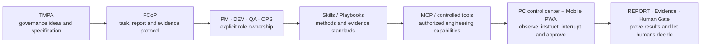

# CodeFlowMu

<p align="center">
  
</p>

<p align="center">
  
  
  
</p>

<p align="center"><strong>Turn a software request into a visible, interruptible, verifiable delivery with a local PM · DEV · QA · OPS digital development team.</strong></p>

<p align="center"><strong>Software delivery is not a chat response. It is a collaboration flow made of roles, tasks, tools, evidence and human decisions.</strong></p>

<p align="center">Free public preview · Proprietary software · Windows x64 · Local-first control plane</p>

<p align="center">
  <a href="README.zh-CN.md">简体中文</a> ·
  <a href="#five-minutes-to-start-thirty-minutes-to-a-first-delivery">Quickstart</a> ·
  <a href="FIRST-PWA-TASK.md">First PWA task</a> ·
  <a href="CUSTOMER-INSTALL.md">Install guide</a> ·
  <a href="ARCHITECTURE.md">Architecture</a> ·
  <a href="https://github.com/joinwell52-AI/CodeflowMu-Distribution/releases/tag/v1.9.7-candidate.1">Candidate download</a>
</p>

> [!IMPORTANT]
> This is the distribution repository for a **free public preview of proprietary software**. It is not the CodeFlowMu source repository and it grants no open-source license. The current `v1.9.7-candidate.1` download is an unsigned pre-release candidate, not a stable or formally supported release. The repository remains Private pending product acceptance and explicit publication approval.

## Why this is not another chat window

An answer is not a delivery. Real software work needs scope, ownership, execution, verification, rework, evidence and a final decision. CodeFlowMu brings that lifecycle into one local control plane:

```text
Request
→ PM clarifies, plans and dispatches
→ DEV implements + OPS runs and delivers + QA verifies and regresses
→ REPORT and runtime evidence
→ PM review
→ human approval, rejection or continuation
```

Tasks, reports, approvals, files, live activity and delivery evidence remain connected. The human operator can see what the team is doing, why it is doing it, what actually changed and when intervention is required.

## See it in 60 seconds

[](https://github.com/joinwell52-AI/CodeflowMu-Distribution/releases/download/v1.9.7-candidate.1/CodeFlowMu-60s-overview-v1.9.7.mp4)

The video uses real product surfaces: the PC control center, task tree, human gate, verification evidence and CodeFlowMu Mobile PWA. [Download the MP4](https://github.com/joinwell52-AI/CodeflowMu-Distribution/releases/download/v1.9.7-candidate.1/CodeFlowMu-60s-overview-v1.9.7.mp4).

## Before running the installer: verify, do not merely trust

A proprietary product cannot honestly claim a reproducible build from source in this repository. CodeFlowMu Distribution uses a **proprietary runtime plus reviewable release evidence**:

| What to verify | Candidate 1 evidence | Current conclusion |
| --- | --- | --- |
| Download origin | This repository's GitHub Release and explicit version tag | Accept only the official Release, never a mirror or forwarded file |
| File integrity | `SHA256SUMS.txt`, `installer-manifest.json` | The installer hash can be recomputed independently |
| Product boundary | `product-manifest.json`, installed-file inventory | The customer package contains no first-party source or source maps |
| Third-party content | `THIRD-PARTY-NOTICES.json` | Dependency and license evidence ships with the version |
| Security state | `runtime-security-audit.json`, `security-risk-acceptance.json` | Reviewed results and accepted risk are recorded separately |
| Traceability | Release closure evidence and declared source commit | The artifact is traceable, but this is not a public-source reproducible build |
| Signing and compatibility | Unsigned; formal real-Cursor-account evidence absent | Candidate preview only, not a stable formal release |

This repository does not use a generic `CI Passing` badge as a substitute for per-release artifact evidence. The current publication gate is a recorded local check and does not depend on GitHub Actions quota. See the [public repository readiness review](PUBLICATION-CHECKLIST.md) and [release policy](RELEASE-POLICY.md).

## Five minutes to start, thirty minutes to a first delivery

### Five minutes: install and open the control center

1. Use a Windows 10/11 x64 machine.
2. Download the installer and `SHA256SUMS.txt` from [V1.9.7 Candidate 1](https://github.com/joinwell52-AI/CodeflowMu-Distribution/releases/tag/v1.9.7-candidate.1).
3. Verify installer SHA-256: `15c96e86d0583540793d0178727a1082ef38395831c460c988d9efc4ad2aca86`.
4. Install and launch **CodeFlowMu**.
5. Confirm that the header reports a connected state, then register an empty example project in Settings.

Verify the download in PowerShell:

```powershell
(Get-FileHash .\CodeFlowMu-Setup-1.9.7-win-x64.exe -Algorithm SHA256).Hash
```

The output must be `15C96E86D0583540793D0178727A1082EF38395831C460C988D9EFC4AD2ACA86`. Do not run the installer if it differs.

> [!WARNING]
> Candidate 1 is unsigned and Windows SmartScreen may warn. The formal real-Cursor-account compatibility gate has not passed. The installation root is not a business project and agents must not develop inside it. Provider accounts, credentials and any usage charges are separate from the free CodeFlowMu preview.

### Thirty minutes: have the team deliver a real static PWA

The standard first task is not “Hello World.” It is an installable, offline-capable and statically hostable **ShipReady PWA**:

- add, complete, reopen and delete today's delivery items;
- persist data in `localStorage`;
- work on phone and desktop widths;
- include a Web App Manifest and Service Worker;
- open offline after the first successful load;
- use no backend, database, CDN or external API;
- deploy to GitHub Pages, Cloudflare Pages or any HTTPS static host.

<details>
<summary><strong>Expand and copy the complete first task to PM</strong></summary>

<br>

```text
Build and deliver a static PWA named ShipReady.

Users can add, complete, reopen and delete “today's delivery items.” Show the total,
completed count and completion percentage. Persist data in localStorage. Support a
390px phone viewport. Include manifest.webmanifest, a Service Worker, 192/512 icons
and a README. Use no backend, database, CDN or external API. After the first load,
the app must still open and work offline.

QA must verify every behavior, refresh persistence, responsive layout, Manifest,
Service Worker, offline mode and console errors. OPS must provide a local run path.
Any public deployment requires my explicit approval before it happens; after approval,
return the deployment URL and verification evidence. PM must summarize the delivery
and every known limitation.
```

</details>

**Next:** follow [Your first ShipReady PWA, step by step](FIRST-PWA-TASK.md) for screen-by-screen actions, success signals, role handoffs, the acceptance table, static deployment and Mobile PWA continuation.

## What happens during the first task

| Stage | Team action | Success signal |
| --- | --- | --- |
| Request enters | You give the brief to PM and review it before publication | A formal TASK appears in the task list |
| Plan and dispatch | PM fixes scope, acceptance criteria and child work | DEV, QA and OPS work appears in the task tree |
| Engineering | DEV creates the static site and PWA capabilities | Page, Manifest, Service Worker and icon files appear in the project |
| Run and deliver | OPS starts a local static server and records the entry point | The local URL works; any public deployment waits for approval |
| Verify and regress | QA tests behavior, phone layout, persistence and offline use | A REPORT maps PASS/FAIL and evidence to every criterion |
| Review and accept | PM summarizes results, limitations and rework | The human accepts, rejects or continues the delivery |

The example demonstrates the central principle: **commands flow, evidence returns, humans decide.**

## The product today: a four-role digital development team

| Role | Current responsibility | Work in the first PWA example |
| --- | --- | --- |
| **PM** | Clarify, plan, dispatch and review | Freeze scope, acceptance criteria and the delivery conclusion |
| **DEV** | Implement and refactor inside an authorized project | Build UI, interaction, storage, Manifest and Service Worker |
| **QA** | Verify criteria, test behavior and report regressions | Test behavior, 390px layout, offline use, installability and errors |
| **OPS** | Run environments, deliver artifacts and record evidence | Start the static service; after approval, deploy and verify the public URL |

The human remains ADMIN: defining project scope, holding credentials, approving external writes and risky operations, and accepting the final result from reports and evidence.

## From theory to engineering

CodeFlowMu is not an isolated app. It is a continuous path from governance ideas to software delivery:



| Path | Entry point | Use it for | Boundary to understand |
| --- | --- | --- | --- |
| Theory and specification | [TMPA / Digital Employee Works](https://github.com/joinwell52-AI/joinwell52) | Study governance architecture, normative Core, conformance and evidence ideas | Follow that repository's own license and status |
| Collaboration protocol | [FCoP](https://github.com/joinwell52-AI/FCoP) | Study or implement the MIT-licensed file-based behavior-governance protocol | The protocol is not the proprietary CodeFlowMu runtime source |
| Early implementation | [CodeFlowMu-open](https://github.com/joinwell52-AI/CodeFlowMu-open) | Inspect the earlier four-role product proof and historical workflows | Maintenance-frozen; not the current product's Community Edition or Open Core |
| Current product | **CodeFlowMu Distribution** | Download the proprietary PC/PWA product, report issues and inspect release evidence | A free preview is not open source; the current Release contract controls |
| Ecosystem integration | Candidate future public SDKs, adapters and examples | Build integrations, adapters and templates against stable interfaces | No compatibility-backed public SDK exists today; this is roadmap only |
| Long-term product direction | **Digital employee development machine** | Produce, test, assemble and upgrade employee packages | Not a current capability |

This is a **Spec First + Proprietary Distribution** path, not a relabeling of the early open-source version as the current product's Open Core. The ideas and protocol continue while product engineering and distribution boundaries evolve; old install methods, ports, capabilities and support status do not transfer to Distribution.

## Skills, MCP, permission and evidence

| Concept | What it answers | What it cannot decide by itself |
| --- | --- | --- |
| **Role** | Who owns planning, implementation, verification or operations? | A role name does not grant unlimited authority |
| **Skill / Playbook** | Which procedure, constraint and evidence standard should a role follow? | A Skill is not a tool and does not create execution authority |
| **MCP / Tool** | Which external capability can an agent connect to and call? | A callable tool does not make a task legitimate or an outcome trustworthy |
| **Permission** | Is this operation authorized for this project and occurrence? | Skill or MCP cannot expand it on their own |
| **FCoP** | How do TASK, REPORT, ISSUE and REVIEW persist and hand off? | A protocol record does not replace a real runtime result |
| **Evidence** | How is a real file, command, test or page demonstrated? | Evidence cannot accept business risk for a human |
| **Human Gate** | Who approves external writes, sensitive actions and final delivery? | Technical checks cannot replace product acceptance |

Candidate 1 ships a Skill schema, a controlled FCoP MCP execution boundary and Browser Use runtime components. A capability is usable only when the product actually ships it, the project enables it and the operation is authorized. This README does not promise automatic installation of arbitrary community MCP servers or formal support for unverified tools.

## Real product surfaces

| PC control center | Task tree |
| --- | --- |
|  |  |

| Runtime and protocol evidence | CodeFlowMu Mobile PWA |
| --- | --- |
|  |  |

## CodeFlowMu Mobile PWA: manage delivery away from the PC

CodeFlowMu Mobile PWA is a remote control surface for a running PC instance, not a second product that executes independently.

```text
Start CodeFlowMu on the PC
→ refresh Gateway and binding information on Mobile
→ bind the phone over LAN or the public Gateway
→ inspect the ShipReady task tree, role states, REPORTs and live activity
→ ask PM from the phone to “add dark mode”
→ review the second QA/OPS evidence cycle
→ handle decisions that require human approval or acceptance
```

Never share a QR code or bind link. Revoke lost or retired devices from the PC. The PWA, Gateway, PC product and Provider have independent version lifecycles. See the [install and Mobile PWA guide](CUSTOMER-INSTALL.md).

## Current capability and roadmap boundary

### Available today

- Windows x64 installer with bundled base Node.js/Python runtimes;
- PC control center for projects, tasks, reports, approvals, files, logs, skills and runtime state;
- fixed PM / DEV / QA / OPS team and visible task tree;
- FCoP-backed task, report, issue, review and evidence collaboration;
- human gates and project authority boundaries;
- Mobile PWA bound to a running PC;
- external Provider lifecycle plus release manifests, security and third-party license evidence.

### Roadmap only

The “digital employee development machine” is intended to produce, test, assemble and upgrade reusable digital employee packages. It remains outside the current product promise until those capabilities ship with their own evidence, compatibility and lifecycle contracts.

### Near-term release gates, not date commitments

- repository visibility may change only after repository-owner product acceptance;
- add code signing for a formal installer;
- add real-account Cursor Provider compatibility evidence;
- continue to record versions, changes, hashes and compatibility boundaries through GitHub Releases;
- decide whether to publish SDKs, adapters and examples only after public interfaces, authority models and compatibility tests are stable.

## Openness boundary: current, candidate and proprietary

| Public now | Evaluate after stabilization | Must remain private |
| --- | --- | --- |
| Product ideas, architecture, four-role responsibilities and sanitized real screenshots | Versioned public APIs and a minimal SDK | Current proprietary product source and private implementation history |
| Public TMPA and FCoP specifications and project relationships | Sanitized adapter, example and template repositories | Unreleased governance experiments and private evaluation policy |
| Skill formats, layers, public templates and sanitized Playbook examples | Extension kits with explicit authority and compatibility contracts | Customer Skills, business knowledge, tasks, reports, logs and data |
| MCP's architectural position, controlled tool classes and safety principles | Security-reviewed client protocols and adapter examples | Gateway credentials, Provider keys, customer MCP configuration and private backend topology |
| Install, first-task, PWA binding and static deployment tutorials | Standalone static examples and verification tools | Signing material, release credentials, internal test accounts and private pipelines |
| Installer, hashes, manifests, third-party notices and reviewed public security evidence | Versioned compatibility matrices and migration examples | Any build or runtime material that has not passed sanitization and publication review |

Public repository visibility does not make the product open source. Technical checks also do not complete product acceptance; only the repository owner's explicit acceptance and publication approval can authorize a future visibility change.

## Documentation and support

- [Your first ShipReady PWA, step by step](FIRST-PWA-TASK.md)
- [Install, Provider, Mobile PWA and upgrade guide](CUSTOMER-INSTALL.md)
- [Architecture and trust boundaries](ARCHITECTURE.md)
- [中文 README](README.zh-CN.md)
- [Release policy](RELEASE-POLICY.md)
- [Public repository readiness review](PUBLICATION-CHECKLIST.md)
- [Support policy](SUPPORT.md)
- [Security policy](SECURITY.md)
- [Proprietary software notice](LICENSE.md)

After publication, use GitHub Issues for sanitized reproducible problems. Never post API keys, bind links, customer data, private source or internal tasks. Report vulnerabilities privately as described in [SECURITY.md](SECURITY.md).

---

**Commands flow. Evidence returns. Humans decide.**
