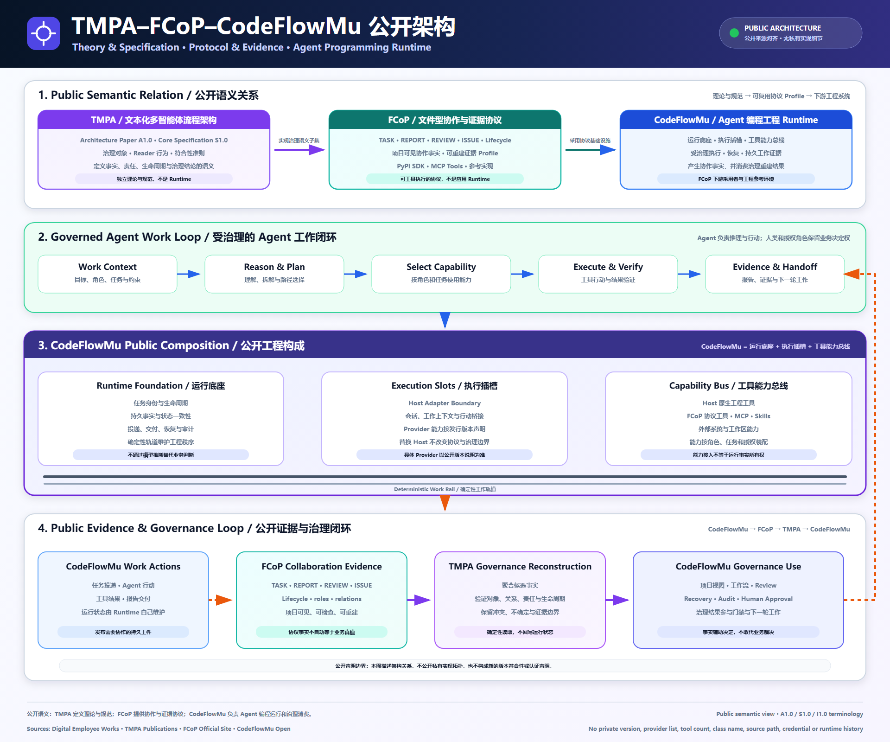
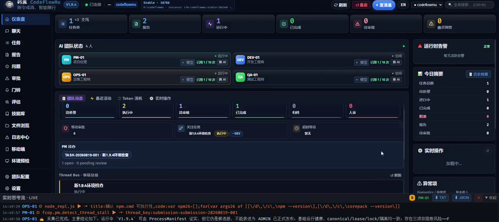
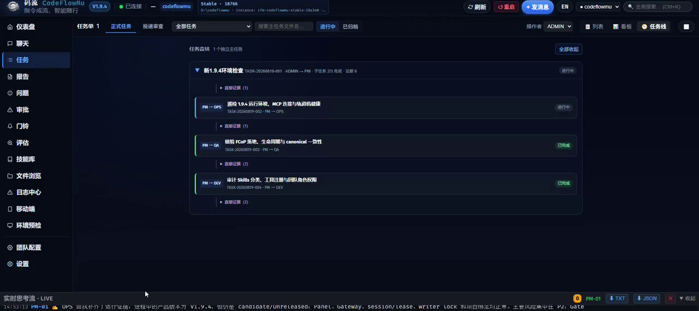
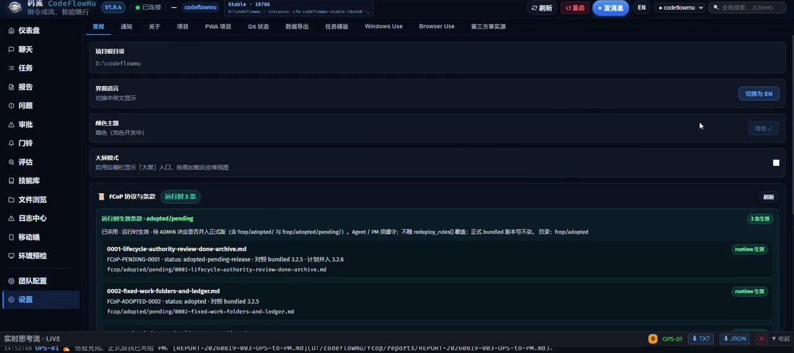
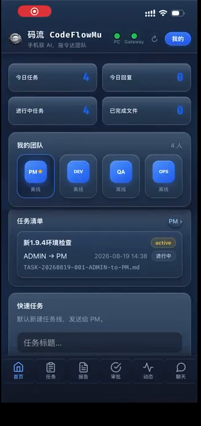

# CodeFlowMu

<p align="center">
  
</p>

<p align="center"><strong>手机指挥的 AI 开发团队：PM · DEV · QA · OPS 随时接单。</strong></p>

<p align="center">从手机下达软件目标、远程查看进度、接管关键动作并验收交付；实际工程在你授权的 Windows 开发机上执行。</p>

<p align="center">不是“再聊一次”，而是让需求真正经历规划、实现、验证、交付和人工决策。</p>

<p align="center"><strong>5 分钟启动控制中心 · 30 分钟跑通第一个可安装、可离线、可静态托管的 PWA 任务</strong></p>

<p align="center">
  
  
  
</p>

<p align="center">免费公开预览 · 专有软件 · Windows x64 · 本地优先控制面</p>

<p align="center">
  <a href="README.md">English</a> ·
  <a href="https://github.com/joinwell52-AI/CodeflowMu-Distribution/releases/download/v2.2.1-preview.17/CodeFlowMu-Setup-2.2.1-preview.17-win-x64.exe"><strong>下载 V2.2.1 Preview 17</strong></a> ·
  <a href="#60-秒看懂产品">观看 60 秒</a> ·
  <a href="#五分钟启动半小时完成第一个任务">快速开始</a> ·
  <a href="FIRST-PWA-TASK.zh-CN.md">第一个 PWA 任务</a> ·
  <a href="CUSTOMER-INSTALL.zh-CN.md">安装手册</a> ·
  <a href="ARCHITECTURE.zh-CN.md">架构与边界</a>
</p>

> [!IMPORTANT]
> 这是 **CodeFlowMu 专有软件免费公开预览版**的发行仓库，不是源码仓库，也不授予开源许可证。当前 `v2.2.1-preview.17` 已通过隔离安装、8882 项安装文件校验、真实首次项目初始化和安装后启动验收，但安装器尚未签名，仍是预发行版，不是稳定版或正式支持版本。仓库目前保持 Private；转为 Public 仍需单独完成公开检查与明确批准。

> [!NOTE]
> `V2.2.1 Preview 17` 已作为 GitHub Pre-release 发布并替代首次初始化缺包的 Preview 15。它提供 CodeFlowMu 品牌安装向导、可编辑安装目录、完整安装包升级，并携带 FCoP 初始化模板、Agent Skills 总表及其引用的 48 个 Skill 包。客户下载附件只有安装器和 `SHA256SUMS.txt`；GitHub 自动显示的 Source code 压缩包不是客户安装包。

## 为什么不是另一个聊天窗口

一次回答不等于一次交付。真正的软件开发需要范围、分工、运行、验证、返工、证据和最终决策。CodeFlowMu 把这些环节放进同一个本地控制面：

```text
需求
→ PM 澄清、规划和分派
→ DEV 实现 + OPS 运行交付 + QA 验证回归
→ REPORT 与运行证据
→ PM 复核
→ 人工批准、驳回或继续
```

任务、报告、审批、文件、实时活动和交付证据彼此关联。人可以知道团队正在做什么、为什么这样做、实际产生了什么，以及什么时候必须接管。

## 60 秒看懂产品

[](https://joinwell52-ai.github.io/joinwell52/assets/video/codeflowmu-product-intro-zh.mp4?v=21-role-matrix)

点击封面将在浏览器中直接播放。视频使用真实产品界面，展示 PC 控制中心、任务树、人工门禁、验证证据和 CodeFlowMu Mobile PWA。[备用：直接打开 1080p MP4](https://joinwell52-ai.github.io/joinwell52/assets/video/codeflowmu-product-intro-zh.mp4?v=21-role-matrix)。

## 安装一次，后续按版本升级

从 `V2.2.1 Preview 15` 起，CodeFlowMu 的 Windows 发行版采用带品牌向导的完整安装包，并支持完整安装包升级；Preview 17 进一步修复了全新安装后的首次项目初始化：

```text
首次或手动安装
→ 看到 CodeFlowMu 欢迎页、产品名称、版本和 Logo
→ 在安装向导中选择安装目录
→ 安装前再次确认目标目录

程序运行中发现更高发行版本
→ 提示“发现新版本”，不擅自下载
→ 用户确认“下载并安装”
→ 下载完整 Windows 安装包
→ 校验更新清单签名、来源、大小与 SHA-256
→ 静默覆盖当前安装目录
→ 核对安装后的产品版本与候选号
→ 自动重启 CodeFlowMu
```

版本判断同时使用产品版本和候选号，例如：

- `V2.2.1-preview.15 < V2.2.1-preview.17`；
- `V2.2.1 < V2.2.2`；
- 相同完整版本不重复下载；
- 更旧版本不会被当作升级目标。

只有通过发行验收并明确发布的 Pre-release，才会写入签名更新源。草稿、本地构建和未发布候选不会触发客户升级。安装程序升级使用客户现有安装目录；客户项目、任务、报告和其他可变数据不应作为程序文件被覆盖。

> [!CAUTION]
> 发行仓库保持 Private 时，普通外部客户无法匿名读取更新源或 Release 安装包。自动升级只有在仓库通过公开验收并明确转为 Public，或未来提供受支持的认证下载服务后，才能作为外部客户能力启用；本次修改不会自动改变仓库可见性。

## 运行安装包之前：先验证，而不是先信任

闭源产品不能假装成“从本仓库源码可复现构建”。CodeFlowMu Distribution 采用的是**专有运行时 + 可审阅的发行证据**：

| 要验证什么 | V2.2.1 Preview 17 提供的内容 | 当前结论 |
| --- | --- | --- |
| 下载来源 | 本仓库的 GitHub Release 与明确版本标签 | 只接受官方 Release，不接受网盘或转发文件 |
| 文件完整性 | `SHA256SUMS.txt` | 安装器哈希可独立复算；不一致时不要运行 |
| 安装、初始化与启动 | Release 说明中的自动验收结论 | 隔离静默安装、首次项目初始化与安装后 `/api/v2/health` 启动检查通过 |
| 签名与 Provider | 安装器未签名；Cursor 采用外部 `sdk.v1` Provider | 只能作为 Preview，不能称为稳定正式版；Provider 账户与兼容验证独立管理 |

Release 下载页刻意只提供安装器和 `SHA256SUMS.txt`。产品清单、模块配置、安全审计和安装验收明细保存在发行工作台的内部版本记录中，不要求客户辨认或下载一组流水线 JSON。本仓库不以一个泛化的 `CI Passing` 徽章代替逐版本检查；完整边界见[公开仓库门禁记录](PUBLICATION-CHECKLIST.md)和[发行政策](RELEASE-POLICY.md)。

## 五分钟启动，半小时完成第一个任务

### 五分钟：安装并打开控制中心

1. 使用 Windows 10/11 x64 电脑。
2. 从 [V2.2.1 Preview 17](https://github.com/joinwell52-AI/CodeflowMu-Distribution/releases/tag/v2.2.1-preview.17) 下载安装器和 `SHA256SUMS.txt`。
3. 校验安装器 SHA-256：`9f934897c35a8e1c260b182d70d565eabfa9d0e6b0d62927788efe3e35e537d4`。
4. 安装并启动 **CodeFlowMu**。
5. 确认顶部连接状态正常，并在设置中注册一个空白示例项目。

在 PowerShell 中校验下载文件：

```powershell
(Get-FileHash .\CodeFlowMu-Setup-2.2.1-preview.17-win-x64.exe -Algorithm SHA256).Hash
```

输出必须为 `9F934897C35A8E1C260B182D70D565EABFA9D0E6B0D62927788EFEE3E35E537D4`；不一致时不要运行安装器。

> [!WARNING]
> V2.2.1 Preview 17 尚未签名，Windows SmartScreen 可能警告。自动验收证明安装包可在隔离目录安装、可从已安装资源初始化一个新项目并正常启动；不代表外部 Provider 账户已经替用户完成配置。安装根不是业务项目，不能让 Agent 在安装目录中开发。Provider 账户、凭据和可能产生的调用费用与 CodeFlowMu 免费预览彼此独立。

### 半小时：让团队交付一个真正的静态 PWA

第一个标准任务不是“Hello World”，而是一个可以安装、离线使用并静态托管的 **ShipReady PWA**：

- 新增、完成、取消完成和删除今日交付事项；
- 使用 `localStorage` 保存数据；
- 适配手机与桌面；
- 提供 Web App Manifest 与 Service Worker；
- 首次加载后可离线打开；
- 不使用后端、数据库、CDN 或外部 API；
- 可部署到 GitHub Pages、Cloudflare Pages 或任意 HTTPS 静态站点。

<details>
<summary><strong>展开并复制给 PM 的完整首任务</strong></summary>

<br>

```text
请开发并交付一个名为 ShipReady 的静态 PWA 小应用。

用户可以新增、完成、取消完成和删除“今日交付事项”；页面显示总数、
已完成数和完成百分比；数据保存在 localStorage；支持 390px 手机宽度；
提供 manifest.webmanifest、Service Worker、192/512 图标和 README；
不使用后端、数据库、CDN 或外部 API。首次加载后断网仍可打开使用。

QA 必须逐条验证功能、刷新持久化、响应式、Manifest、Service Worker、
离线模式和控制台错误；OPS 必须提供本地运行方式。任何公网部署都要先
获得我的明确批准，再返回部署 URL 和验证证据；PM 最后汇总交付和限制。
```

</details>

**下一步：** 按[手把手完成第一个 ShipReady PWA](FIRST-PWA-TASK.zh-CN.md)逐屏操作，查看成功信号、角色分工、验收表、静态部署和 PWA 续接流程。

## 第一个任务会发生什么

| 阶段 | 角色动作 | 你应该看到的成功信号 |
| --- | --- | --- |
| 需求进入 | 你把任务交给 PM 并检查发布内容 | 正式 TASK 出现在任务列表 |
| 规划分派 | PM 固定范围、验收标准和子任务 | 任务树出现 DEV、QA、OPS 工作 |
| 工程实现 | DEV 创建静态文件和 PWA 能力 | 项目中出现页面、Manifest、Service Worker 和图标 |
| 运行交付 | OPS 启动本地静态服务并记录入口 | 本地 URL 可访问；若要公网部署会先请求批准 |
| 验证回归 | QA 检查功能、手机布局、持久化和离线 | REPORT 对每条验收标准给出 PASS/FAIL 与证据 |
| 复核验收 | PM 汇总结果、限制和返工项 | 人选择接受、驳回或继续修改 |

这个案例同时展示 CodeFlowMu 的核心原则：**指令成流，证据回流，由人决策。**

## 当前产品：四人数字开发团队

| 角色 | 当前职责 | 第一个 PWA 案例中的工作 |
| --- | --- | --- |
| **PM** | 澄清需求、规划、分派和复核 | 固定范围、验收标准和交付结论 |
| **DEV** | 在授权项目内实现和重构 | 实现 UI、交互、存储、Manifest 和 Service Worker |
| **QA** | 验证标准、测试行为和报告回归 | 验证功能、390px 布局、离线、安装条件和错误 |
| **OPS** | 运行环境、构建产物和记录证据 | 启动静态服务；获批后部署并验证公网 URL |

人始终是 ADMIN：决定项目范围，持有凭据，批准外部写入和风险操作，并依据报告与证据完成最终验收。

## 公开架构：TMPA → FCoP → CodeFlowMu

CodeFlowMu 是这套公开三段架构中的工程实现：TMPA 定义治理理论与规范语义，FCoP 将协作与证据落成可由工具执行的协议，CodeFlowMu 则提供执行真实工程工作的 Agent 编程 Runtime。

<p align="center">
  <picture>
    <source srcset="assets/architecture/tmpa-fcop-codeflowmu-public-architecture.svg" type="image/svg+xml">
    
  </picture>
</p>

| 系统 | 公开定位 | 提供什么 | 不是什么 |
| --- | --- | --- | --- |
| **TMPA** | 理论与规范治理层 | 治理对象、角色与动作关系、Reader 语义、符合性判定 | 应用 Runtime 或工具宿主 |
| **FCoP** | 文件型协作与证据协议 | TASK / REPORT / REVIEW / ISSUE 记录、生命周期语义、引用关系，以及 PyPI、MCP 等工具入口 | CodeFlowMu Runtime，也不替代真实执行 |
| **CodeFlowMu** | Agent 编程工程 Runtime | 由**运行底座、执行插槽、能力总线**构成，接入模型、Skills、MCP 工具和本地工程工具 | TMPA 或 FCoP 的改名 |

运行闭环是：**CodeFlowMu 工作动作 → FCoP 协作证据 → TMPA 治理重建 → CodeFlowMu 治理使用**。本图只表达可公开的语义关系，不披露私有部署拓扑、供应商配置、内部类名或凭据，也不据此新增任何符合性声明。

公开资料：[TMPA A1.0](https://joinwell52-ai.github.io/joinwell52/zh/publications/tmpa-architecture-paper-a1.0) · [TMPA S1.0](https://joinwell52-ai.github.io/joinwell52/zh/publications/tmpa-core-specification-s1.0) · [TMPA–FCoP–CodeFlowMu I1.0](https://joinwell52-ai.github.io/joinwell52/zh/publications/implementation-case-i1.0) · [FCoP](https://joinwell52-ai.github.io/FCoP/) · [公开架构与信任边界](ARCHITECTURE.zh-CN.md)

| 路径 | 入口 | 适合做什么 | 必须知道的边界 |
| --- | --- | --- | --- |
| 理论与规范 | [TMPA / Digital Employee Works](https://github.com/joinwell52-AI/joinwell52) | 研究治理架构、规范 Core、符合性与证据思想 | 按该仓库自身许可与状态使用 |
| 协作协议 | [FCoP](https://github.com/joinwell52-AI/FCoP) | 研究或实现 MIT 许可的文件化行为治理协议 | 协议不是 CodeFlowMu 商业运行时源码 |
| 早期实现 | [CodeFlowMu-open](https://github.com/joinwell52-AI/CodeFlowMu-open) | 阅读早期四角色产品验证和历史工作流 | 已维护冻结，不是当前产品的 Community Edition 或 Open Core |
| 当前产品 | **CodeFlowMu Distribution** | 下载并使用专有 PC/PWA 产品，提交问题和阅读发行证据 | 免费预览不等于开源；以当前 Release 合同为准 |
| 生态接入 | 未来公开 SDK、Adapters、Examples 的候选方向 | 在稳定接口上开发集成、适配器和模板 | 当前没有可承诺兼容性的公共 SDK；发布前只属于路线 |
| 长期产品路线 | **数字员工开发机** | 生产、测试、装配和升级数字员工包 | 尚不是当前能力 |

这是一条 **Spec First + Proprietary Distribution** 路径，不是把早期开源版重新命名为当前产品的 Open Core。思想和协议连续，产品工程与发行边界升级；旧版安装方式、端口、能力和支持状态不能直接套用到 Distribution。

## Skill、MCP、权限与证据

| 概念 | 它回答什么 | 它不能自行决定什么 |
| --- | --- | --- |
| **Role** | 谁负责规划、实现、验证或运行 | 不能因为角色名称自动获得全部权限 |
| **Skill / Playbook** | 角色应按什么步骤、约束和证据标准工作 | Skill 不是工具，也不自动产生执行权 |
| **MCP / Tool** | Agent 可以连接并调用什么外部能力 | 工具可调用不代表任务合法、结果可信 |
| **Permission** | 本次操作是否被项目和人授权 | 不能由 Skill 或 MCP 自行扩大 |
| **FCoP** | TASK、REPORT、ISSUE、REVIEW 如何持久化与交接 | 协议记录不能替代真实运行结果 |
| **Evidence** | 如何证明文件、命令、测试或页面真实产生 | 证据本身不能替人接受业务风险 |
| **Human Gate** | 谁批准外部写入、敏感动作和最终交付 | 技术检查不能替代人的产品验收 |

V2.2.1 Preview 17 包含 Skill schema、48 个清单引用 Skill 包、FCoP 受控 MCP 执行边界和 Browser Use 运行组件；具体能力只有在产品实际提供、项目启用并获得授权时才可使用。本 README 不承诺自动安装任意社区 MCP，也不把未验证工具描述为正式支持能力。

## 真实产品界面

| PC 控制中心 | 任务树 |
| --- | --- |
|  |  |

| 运行与协议证据 | CodeFlowMu Mobile PWA |
| --- | --- |
|  |  |

## CodeFlowMu Mobile PWA：离开电脑后继续管理交付

CodeFlowMu Mobile PWA 是运行中 PC 实例的远程控制入口，不是脱离 PC 独立执行的第二套产品。

```text
PC 启动 CodeFlowMu
→ 在“移动端”页面刷新 Gateway 与绑定信息
→ 手机通过局域网或公网 Gateway 绑定
→ 查看 ShipReady 任务树、角色状态、REPORT 和实时活动
→ 从手机向 PM 追加“增加深色模式”
→ 阅读第二轮 QA/OPS 证据
→ 处理需要人工决定的审批与验收
```

绑定时不要分享二维码或绑定链接；丢失或停用的设备应从 PC 解除绑定。PWA、Gateway、PC 产品和 Provider 使用不同版本生命周期。完整步骤见[中文安装与 PWA 指南](CUSTOMER-INSTALL.zh-CN.md)。

## 当前能力与路线边界

### 当前已经提供

- Windows x64 安装包与内置基础 Node.js/Python Runtime；
- PC 控制中心：项目、任务、报告、审批、文件、日志、技能和运行状态；
- 固定 PM / DEV / QA / OPS 团队与可见任务树；
- FCoP 文件化任务、报告、问题、复核与证据协作；
- 人工门禁和项目授权边界；
- 绑定运行中 PC 的 Mobile PWA；
- 外部 Provider 生命周期以及 Release manifest、安全与第三方许可证据。

### Preview 17 已完成工程验收并发布

- CodeFlowMu 品牌欢迎页、产品 Logo、完整候选号和不重名安装包文件名；
- 交互式安装时选择目标目录，并在写入文件前显示最终目录；
- 使用产品版本号与候选号共同判断是否存在新版本；
- 用户确认后下载、校验并安装完整 Windows 安装包；
- 升级后核对版本、保留当前安装目录并自动重启；
- 发行工作台仅在已验收 Pre-release 发布后激活对应更新源。
- 从安装后产品资源完成一次隔离的新项目初始化，核验 FCoP 模板、Skills 总表和 48 个引用 Skill 包。

### 仍然只是路线

“数字员工开发机”将面向可复用数字员工包的生产、测试、装配和升级。在这些能力真实交付并具备自己的证据、兼容和生命周期合同之前，不进入当前产品承诺。

### 近期发行门禁，不是日期承诺

- 完成仓库所有者产品验收后，才允许把发行仓库转为 Public；
- 为正式安装器补齐代码签名；
- 补齐 Cursor Provider 的真实账户兼容证据；
- 继续通过 GitHub Releases 记录版本、变更、哈希与兼容边界；
- 只有公共接口稳定、权限模型明确并能做兼容测试后，才决定是否发布 SDK、Adapters 和 Examples。

## 开放边界：现在、候选路线与商业壁垒

| 现在可以公开 | 稳定后可评估开放 | 必须保持私有 |
| --- | --- | --- |
| 产品思想、架构、四角色职责和真实脱敏截图 | 版本化公共 API 与最小 SDK | 当前专有产品源码和私有实现历史 |
| TMPA、FCoP 公开规范与项目关系 | 脱敏的 Adapters、Examples 与模板仓库 | 未发布治理实验和私有评估策略 |
| Skill 格式、分层、公开模板和脱敏 Playbook 示例 | 具备权限与兼容合同的扩展开发包 | 客户 Skill、业务知识、任务、报告、日志和数据 |
| MCP 的架构位置、受控工具分类和安全原则 | 经安全审查的客户端协议与适配示例 | Gateway 凭据、Provider 密钥、客户 MCP 配置和私有后台拓扑 |
| 安装、首任务、PWA 绑定和静态部署教程 | 独立静态示例应用与验证工具 | 签名材料、发行凭据、内部测试账户和私有流水线 |
| 安装包、哈希、manifest、第三方许可与公开安全证据 | 版本化兼容矩阵与迁移示例 | 未完成脱敏和公开审查的任何构建或运行材料 |

仓库可见性变为 Public 不等于产品开源。技术检查通过也不等于产品验收完成；只有仓库所有者明确验收并批准后才能公开。

## 文档与支持

- [手把手完成第一个 ShipReady PWA](FIRST-PWA-TASK.zh-CN.md)
- [中文安装、Provider、Mobile PWA 与升级说明](CUSTOMER-INSTALL.zh-CN.md)
- [公开架构与信任边界](ARCHITECTURE.zh-CN.md)
- [English README](README.md)
- [Release Policy](RELEASE-POLICY.md)
- [公开仓库门禁记录](PUBLICATION-CHECKLIST.md)
- [支持政策](SUPPORT.md)
- [安全政策](SECURITY.md)
- [专有软件说明](LICENSE.md)

公开后可通过 GitHub Issues 提交脱敏后的可复现问题。严禁公开提交 API Key、绑定链接、客户数据、私有源码或内部任务；安全漏洞必须按 [SECURITY.md](SECURITY.md) 私下报告。

---

**指令成流，证据回流，由人决策。**
