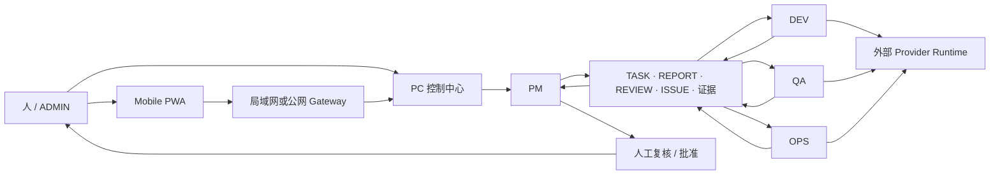

# CodeFlowMu

<p align="center">
  
</p>

<p align="center"><strong>把一个软件需求交给本地的 PM · DEV · QA · OPS 四人数字开发团队，获得可见、可接管、可验收的交付过程。</strong></p>

<p align="center">免费公开预览 · 专有软件 · Windows x64 · 本地优先控制面</p>

<p align="center">
  <a href="README.md">English</a> ·
  <a href="#快速开始">快速开始</a> ·
  <a href="https://github.com/joinwell52-AI/CodeflowMu-Distribution/releases">下载</a> ·
  <a href="CUSTOMER-INSTALL.zh-CN.md">安装说明</a> ·
  <a href="ARCHITECTURE.zh-CN.md">架构</a>
</p>

> [!IMPORTANT]
> 这是 **CodeFlowMu 专有软件免费公开预览版**的发行仓库，不是 CodeFlowMu 源码仓库，也不授予开源许可证。当前下载是候选预发行版，不是稳定版或正式支持版本。

## CodeFlowMu 解决什么问题

给 AI Agent 一段提示词很容易，真正的软件交付却需要持续协调：需求会漂移，工作容易消失在聊天记录里，实现与验证混在一起，人也很难判断什么时候该介入。

CodeFlowMu 为这条链路提供一个可见的工作面：

```text
需求 → PM 规划 → DEV 实现 + OPS 运行 + QA 验证
     → 报告与证据 → PM 复核 → 人工批准
```

任务、报告、审批、实时运行状态和交付证据彼此关联。操作者可以查看进展、随时接管并依据证据验收，而不必只相信最后一句“已经完成”。

## 60 秒看懂产品

[](https://github.com/joinwell52-AI/CodeflowMu-Distribution/releases/download/v1.9.7-candidate.1/CodeFlowMu-60s-overview-v1.9.7.mp4)

视频展示的是真实 PC 控制中心、任务流、人工门禁、验证证据和 Mobile PWA。[直接下载 MP4](https://github.com/joinwell52-AI/CodeflowMu-Distribution/releases/download/v1.9.7-candidate.1/CodeFlowMu-60s-overview-v1.9.7.mp4)。

## 快速开始

### 五分钟：打开控制中心

1. 准备 Windows 10/11 x64 电脑。
2. 打开 [V1.9.7 Candidate 1](https://github.com/joinwell52-AI/CodeflowMu-Distribution/releases/tag/v1.9.7-candidate.1)，下载 `CodeFlowMu-Setup-1.9.7-win-x64.exe` 和 `SHA256SUMS.txt`。
3. 校验 SHA-256：`15c96e86d0583540793d0178727a1082ef38395831c460c988d9efc4ad2aca86`。
4. 运行安装器，再从开始菜单或桌面快捷方式启动 **CodeFlowMu**。

> [!WARNING]
> Candidate 1 尚未签名，Windows SmartScreen 可能提示风险。它只用于预览和安装测试；正式 Cursor 账户兼容门禁尚未通过，不能把它视为稳定版或正式支持版本。

### 半小时：跑通一个小型交付闭环

1. 注册一个新项目或已有项目，不要把 CodeFlowMu 安装目录当作业务项目工作区。
2. 配置你自己的受支持 Provider 凭据；Provider 账户和可能产生的调用费用不属于 CodeFlowMu 免费预览范围。
3. 给 PM 一个范围明确、带验收标准的小需求。
4. 查看 PM 如何把工作分派给 DEV、OPS 和 QA。
5. 检查各角色返回的报告与证据，再选择批准、驳回或继续处理。

Provider、Mobile PWA、升级和卸载的完整步骤见[中文安装说明](CUSTOMER-INSTALL.zh-CN.md)。

## 当前产品：四人数字开发团队

| 角色 | 当前职责 |
| --- | --- |
| **PM** | 澄清需求、规划工作、分发任务并复核交付 |
| **DEV** | 在授权项目内实现功能和重构代码 |
| **QA** | 按验收标准验证行为、测试功能并报告回归 |
| **OPS** | 运行环境、构建产物并记录操作证据 |

四个角色通过文件化协作与证据链衔接工作。人始终是管理员：项目访问、敏感操作、审批和最终验收都保持可见、可控。

| PC 控制中心 | 任务树 |
| --- | --- |
|  |  |

| 运行证据 | Mobile PWA |
| --- | --- |
|  |  |

## 架构



Windows 产品内置基础 Node.js 和 Python Runtime。真实 Cursor bridge 不放进主安装包，而是作为外部 Provider Runtime 独立安装、独立版本化，使用客户自己的凭据，并拥有与 CodeFlowMu 分离的兼容生命周期。详见[架构与信任边界](ARCHITECTURE.zh-CN.md)和[发行政策](RELEASE-POLICY.md)。

## 现在已经具备的能力

- Windows x64 安装包和内置基础 Runtime；无需预装 Git、系统 Node.js 或系统 Python。
- 管理项目、任务、报告、审批、文件、日志、技能和 Runtime 状态的 PC 控制中心。
- 固定的 PM / DEV / QA / OPS 数字开发团队，以及可见的任务和证据交接。
- 面向敏感操作与最终验收的人工门禁。
- 通过局域网或公网 Gateway 绑定正在运行的 PC 实例的 Mobile PWA。
- 与候选安装包同时提供的产品清单、SHA-256、第三方声明与安全证据。

## 必须知道的边界

| 范围 | 边界 |
| --- | --- |
| 费用 | 当前预览版本身可免费下载和使用；外部 Provider 账户或服务可能单独收费。 |
| 源码 | CodeFlowMu Distribution 是专有闭源软件。仓库公开不代表源码公开，也不授予开源许可证。 |
| 版本状态 | `v1.9.7-candidate.1` 是预览/测试用 pre-release，不是稳定版或正式支持的客户版本。 |
| 平台 | 当前打包目标只有 Windows x64。 |
| 签名 | Candidate 1 尚未签名，可能触发 SmartScreen；运行前必须校验公开的 SHA-256。 |
| Provider | Cursor Runtime 和凭据位于外部；Candidate 1 尚未通过真实 Cursor 账户兼容门禁。 |
| 移动端 | PWA 是运行中 PC 实例的远程入口，不能脱离 PC 独立执行团队任务。 |
| 数据 | 源码、任务和证据应放在已注册项目中；升级前请备份重要工作。 |
| 支持 | 预览期只提供尽力支持，不承诺可用性、兼容性或响应时间 SLA。 |

## 两代产品，两套边界

| 仓库 | 角色 | 许可与状态 |
| --- | --- | --- |
| **[CodeFlowMu Distribution](https://github.com/joinwell52-AI/CodeflowMu-Distribution)** | 当前打包产品与下载入口 | 免费公开预览，专有软件 |
| **[CodeFlowMu-open](https://github.com/joinwell52-AI/CodeFlowMu-open)** | 早期开源实现和历史参考 | MIT 许可证，维护冻结 |

CodeFlowMu-open 保留早期公开实现、截图和工作流积累，但它不是当前 Distribution 产品的源码。旧版的安装方式、能力、端口、发行周期和支持状态不能直接套用到当前产品。

## 路线：数字员工开发机

长期方向是“**数字员工开发机**”：用于生产、测试、装配和升级可复用的数字员工包。这是路线，不是当前预览版已经交付的能力。现阶段 CodeFlowMu 的产品定义就是上面所述的 PM、DEV、QA、OPS 四人数字开发团队。

## 文档与支持

- [中文安装、移动端、Provider 与升级说明](CUSTOMER-INSTALL.zh-CN.md)
- [English install, Mobile PWA, Provider and upgrade guide](CUSTOMER-INSTALL.md)
- [中文架构与信任边界](ARCHITECTURE.zh-CN.md)
- [Architecture and trust boundaries](ARCHITECTURE.md)
- [发行政策](RELEASE-POLICY.md)
- [公开仓库门禁记录](PUBLICATION-CHECKLIST.md)
- [支持政策](SUPPORT.md)
- [安全政策](SECURITY.md)
- [专有软件说明](LICENSE.md)

可通过 [GitHub Issues](https://github.com/joinwell52-AI/CodeflowMu-Distribution/issues) 提交可复现问题和预览反馈。请勿公开提交密钥、绑定链接、API Key、私有任务或客户数据；安全漏洞请按 [SECURITY.md](SECURITY.md) 私下报告。

---

**指令成流，证据回流，由人决策。**
