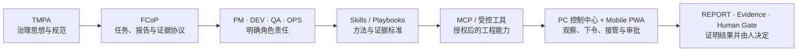

# CodeFlowMu

<p align="center">
  
</p>

<p align="center"><strong>手机指挥的 AI 开发团队：PM · DEV · QA · OPS 随时接单。</strong></p>

<p align="center">从手机下达软件目标、远程查看进度、接管关键动作并验收交付；实际工程在你授权的 Windows 开发机上执行。</p>

<p align="center">不是“再聊一次”，而是让需求真正经历规划、实现、验证、交付和人工决策。</p>

<p align="center"><strong>5 分钟启动控制中心 · 30 分钟跑通第一个可安装、可离线、可静态托管的 PWA 任务</strong></p>

<p align="center">
  
  
  
</p>

<p align="center">免费公开预览 · 专有软件 · Windows x64 · 本地优先控制面</p>

<p align="center">
  <a href="README.md">English</a> ·
  <a href="https://github.com/joinwell52-AI/CodeflowMu-Distribution/releases/tag/v1.9.7-candidate.1"><strong>下载 Candidate</strong></a> ·
  <a href="#60-秒看懂产品">观看 60 秒</a> ·
  <a href="#五分钟启动半小时完成第一个任务">快速开始</a> ·
  <a href="FIRST-PWA-TASK.zh-CN.md">第一个 PWA 任务</a> ·
  <a href="CUSTOMER-INSTALL.zh-CN.md">安装手册</a> ·
  <a href="ARCHITECTURE.zh-CN.md">架构与边界</a>
</p>

> [!IMPORTANT]
> 这是 **CodeFlowMu 专有软件免费公开预览版**的发行仓库，不是源码仓库，也不授予开源许可证。当前 `v1.9.7-candidate.1` 是未签名的候选预发行版，不是稳定版或正式支持版本。仓库目前保持 Private，等待产品验收和明确的公开批准。

## 为什么不是另一个聊天窗口

一次回答不等于一次交付。真正的软件开发需要范围、分工、运行、验证、返工、证据和最终决策。CodeFlowMu 把这些环节放进同一个本地控制面：

```text
需求
→ PM 澄清、规划和分派
→ DEV 实现 + OPS 运行交付 + QA 验证回归
→ REPORT 与运行证据
→ PM 复核
→ 人工批准、驳回或继续
```

任务、报告、审批、文件、实时活动和交付证据彼此关联。人可以知道团队正在做什么、为什么这样做、实际产生了什么，以及什么时候必须接管。

## 60 秒看懂产品

[](https://joinwell52-ai.github.io/joinwell52/assets/video/codeflowmu-product-intro-zh.mp4?v=20-rolefix)

点击封面将在浏览器中直接播放。视频使用真实产品界面，展示 PC 控制中心、任务树、人工门禁、验证证据和 CodeFlowMu Mobile PWA。[备用：下载 1080p MP4](https://github.com/joinwell52-AI/CodeflowMu-Distribution/releases/download/v1.9.7-candidate.1/CodeFlowMu-60s-overview-v1.9.7.mp4)。

## 运行安装包之前：先验证，而不是先信任

闭源产品不能假装成“从本仓库源码可复现构建”。CodeFlowMu Distribution 采用的是**专有运行时 + 可审阅的发行证据**：

| 要验证什么 | Candidate 1 提供的证据 | 当前结论 |
| --- | --- | --- |
| 下载来源 | 本仓库的 GitHub Release 与明确版本标签 | 只接受官方 Release，不接受网盘或转发文件 |
| 文件完整性 | `SHA256SUMS.txt`、`installer-manifest.json` | 安装器哈希可独立复算 |
| 产品边界 | `product-manifest.json`、安装文件清单 | 客户安装包不包含第一方源码或 Source Map |
| 第三方成分 | `THIRD-PARTY-NOTICES.json` | 依赖与许可证据随版本发布 |
| 安全状态 | `runtime-security-audit.json`、`security-risk-acceptance.json` | 已审查结果与已接受风险分开记录 |
| 可追溯性 | Release closure evidence 与声明的源提交 | 可以追溯产物，但不等同于公开源码可复现构建 |
| 签名与兼容 | 未签名；正式 Cursor 真实账户证据缺失 | 只能作为 Candidate 预览，不能称为稳定正式版 |

本仓库不以一个泛化的 `CI Passing` 徽章代替逐版本产物证据。当前公开门禁采用有记录的本地检查，不依赖 GitHub Actions 额度；完整边界见[公开仓库门禁记录](PUBLICATION-CHECKLIST.md)和[发行政策](RELEASE-POLICY.md)。

## 五分钟启动，半小时完成第一个任务

### 五分钟：安装并打开控制中心

1. 使用 Windows 10/11 x64 电脑。
2. 从 [V1.9.7 Candidate 1](https://github.com/joinwell52-AI/CodeflowMu-Distribution/releases/tag/v1.9.7-candidate.1) 下载安装器和 `SHA256SUMS.txt`。
3. 校验安装器 SHA-256：`15c96e86d0583540793d0178727a1082ef38395831c460c988d9efc4ad2aca86`。
4. 安装并启动 **CodeFlowMu**。
5. 确认顶部连接状态正常，并在设置中注册一个空白示例项目。

在 PowerShell 中校验下载文件：

```powershell
(Get-FileHash .\CodeFlowMu-Setup-1.9.7-win-x64.exe -Algorithm SHA256).Hash
```

输出必须为 `15C96E86D0583540793D0178727A1082EF38395831C460C988D9EFC4AD2ACA86`；不一致时不要运行安装器。

> [!WARNING]
> Candidate 1 尚未签名，Windows SmartScreen 可能警告；正式 Cursor 账户兼容门禁尚未通过。安装根不是业务项目，不能让 Agent 在安装目录中开发。Provider 账户、凭据和可能产生的调用费用与 CodeFlowMu 免费预览彼此独立。

### 半小时：让团队交付一个真正的静态 PWA

第一个标准任务不是“Hello World”，而是一个可以安装、离线使用并静态托管的 **ShipReady PWA**：

- 新增、完成、取消完成和删除今日交付事项；
- 使用 `localStorage` 保存数据；
- 适配手机与桌面；
- 提供 Web App Manifest 与 Service Worker；
- 首次加载后可离线打开；
- 不使用后端、数据库、CDN 或外部 API；
- 可部署到 GitHub Pages、Cloudflare Pages 或任意 HTTPS 静态站点。

<details>
<summary><strong>展开并复制给 PM 的完整首任务</strong></summary>

<br>

```text
请开发并交付一个名为 ShipReady 的静态 PWA 小应用。

用户可以新增、完成、取消完成和删除“今日交付事项”；页面显示总数、
已完成数和完成百分比；数据保存在 localStorage；支持 390px 手机宽度；
提供 manifest.webmanifest、Service Worker、192/512 图标和 README；
不使用后端、数据库、CDN 或外部 API。首次加载后断网仍可打开使用。

QA 必须逐条验证功能、刷新持久化、响应式、Manifest、Service Worker、
离线模式和控制台错误；OPS 必须提供本地运行方式。任何公网部署都要先
获得我的明确批准，再返回部署 URL 和验证证据；PM 最后汇总交付和限制。
```

</details>

**下一步：** 按[手把手完成第一个 ShipReady PWA](FIRST-PWA-TASK.zh-CN.md)逐屏操作，查看成功信号、角色分工、验收表、静态部署和 PWA 续接流程。

## 第一个任务会发生什么

| 阶段 | 角色动作 | 你应该看到的成功信号 |
| --- | --- | --- |
| 需求进入 | 你把任务交给 PM 并检查发布内容 | 正式 TASK 出现在任务列表 |
| 规划分派 | PM 固定范围、验收标准和子任务 | 任务树出现 DEV、QA、OPS 工作 |
| 工程实现 | DEV 创建静态文件和 PWA 能力 | 项目中出现页面、Manifest、Service Worker 和图标 |
| 运行交付 | OPS 启动本地静态服务并记录入口 | 本地 URL 可访问；若要公网部署会先请求批准 |
| 验证回归 | QA 检查功能、手机布局、持久化和离线 | REPORT 对每条验收标准给出 PASS/FAIL 与证据 |
| 复核验收 | PM 汇总结果、限制和返工项 | 人选择接受、驳回或继续修改 |

这个案例同时展示 CodeFlowMu 的核心原则：**指令成流，证据回流，由人决策。**

## 当前产品：四人数字开发团队

| 角色 | 当前职责 | 第一个 PWA 案例中的工作 |
| --- | --- | --- |
| **PM** | 澄清需求、规划、分派和复核 | 固定范围、验收标准和交付结论 |
| **DEV** | 在授权项目内实现和重构 | 实现 UI、交互、存储、Manifest 和 Service Worker |
| **QA** | 验证标准、测试行为和报告回归 | 验证功能、390px 布局、离线、安装条件和错误 |
| **OPS** | 运行环境、构建产物和记录证据 | 启动静态服务；获批后部署并验证公网 URL |

人始终是 ADMIN：决定项目范围，持有凭据，批准外部写入和风险操作，并依据报告与证据完成最终验收。

## 从理论到工程

CodeFlowMu 不是孤立产品，而是一条从治理思想落到软件交付的连续路径：



| 路径 | 入口 | 适合做什么 | 必须知道的边界 |
| --- | --- | --- | --- |
| 理论与规范 | [TMPA / Digital Employee Works](https://github.com/joinwell52-AI/joinwell52) | 研究治理架构、规范 Core、符合性与证据思想 | 按该仓库自身许可与状态使用 |
| 协作协议 | [FCoP](https://github.com/joinwell52-AI/FCoP) | 研究或实现 MIT 许可的文件化行为治理协议 | 协议不是 CodeFlowMu 商业运行时源码 |
| 早期实现 | [CodeFlowMu-open](https://github.com/joinwell52-AI/CodeFlowMu-open) | 阅读早期四角色产品验证和历史工作流 | 已维护冻结，不是当前产品的 Community Edition 或 Open Core |
| 当前产品 | **CodeFlowMu Distribution** | 下载并使用专有 PC/PWA 产品，提交问题和阅读发行证据 | 免费预览不等于开源；以当前 Release 合同为准 |
| 生态接入 | 未来公开 SDK、Adapters、Examples 的候选方向 | 在稳定接口上开发集成、适配器和模板 | 当前没有可承诺兼容性的公共 SDK；发布前只属于路线 |
| 长期产品路线 | **数字员工开发机** | 生产、测试、装配和升级数字员工包 | 尚不是当前能力 |

这是一条 **Spec First + Proprietary Distribution** 路径，不是把早期开源版重新命名为当前产品的 Open Core。思想和协议连续，产品工程与发行边界升级；旧版安装方式、端口、能力和支持状态不能直接套用到 Distribution。

## Skill、MCP、权限与证据

| 概念 | 它回答什么 | 它不能自行决定什么 |
| --- | --- | --- |
| **Role** | 谁负责规划、实现、验证或运行 | 不能因为角色名称自动获得全部权限 |
| **Skill / Playbook** | 角色应按什么步骤、约束和证据标准工作 | Skill 不是工具，也不自动产生执行权 |
| **MCP / Tool** | Agent 可以连接并调用什么外部能力 | 工具可调用不代表任务合法、结果可信 |
| **Permission** | 本次操作是否被项目和人授权 | 不能由 Skill 或 MCP 自行扩大 |
| **FCoP** | TASK、REPORT、ISSUE、REVIEW 如何持久化与交接 | 协议记录不能替代真实运行结果 |
| **Evidence** | 如何证明文件、命令、测试或页面真实产生 | 证据本身不能替人接受业务风险 |
| **Human Gate** | 谁批准外部写入、敏感动作和最终交付 | 技术检查不能替代人的产品验收 |

Candidate 1 包含 Skill schema、FCoP 受控 MCP 执行边界和 Browser Use 运行组件；具体能力只有在产品实际提供、项目启用并获得授权时才可使用。本 README 不承诺自动安装任意社区 MCP，也不把未验证工具描述为正式支持能力。

## 真实产品界面

| PC 控制中心 | 任务树 |
| --- | --- |
|  |  |

| 运行与协议证据 | CodeFlowMu Mobile PWA |
| --- | --- |
|  |  |

## CodeFlowMu Mobile PWA：离开电脑后继续管理交付

CodeFlowMu Mobile PWA 是运行中 PC 实例的远程控制入口，不是脱离 PC 独立执行的第二套产品。

```text
PC 启动 CodeFlowMu
→ 在“移动端”页面刷新 Gateway 与绑定信息
→ 手机通过局域网或公网 Gateway 绑定
→ 查看 ShipReady 任务树、角色状态、REPORT 和实时活动
→ 从手机向 PM 追加“增加深色模式”
→ 阅读第二轮 QA/OPS 证据
→ 处理需要人工决定的审批与验收
```

绑定时不要分享二维码或绑定链接；丢失或停用的设备应从 PC 解除绑定。PWA、Gateway、PC 产品和 Provider 使用不同版本生命周期。完整步骤见[中文安装与 PWA 指南](CUSTOMER-INSTALL.zh-CN.md)。

## 当前能力与路线边界

### 当前已经提供

- Windows x64 安装包与内置基础 Node.js/Python Runtime；
- PC 控制中心：项目、任务、报告、审批、文件、日志、技能和运行状态；
- 固定 PM / DEV / QA / OPS 团队与可见任务树；
- FCoP 文件化任务、报告、问题、复核与证据协作；
- 人工门禁和项目授权边界；
- 绑定运行中 PC 的 Mobile PWA；
- 外部 Provider 生命周期以及 Release manifest、安全与第三方许可证据。

### 仍然只是路线

“数字员工开发机”将面向可复用数字员工包的生产、测试、装配和升级。在这些能力真实交付并具备自己的证据、兼容和生命周期合同之前，不进入当前产品承诺。

### 近期发行门禁，不是日期承诺

- 完成仓库所有者产品验收后，才允许把发行仓库转为 Public；
- 为正式安装器补齐代码签名；
- 补齐 Cursor Provider 的真实账户兼容证据；
- 继续通过 GitHub Releases 记录版本、变更、哈希与兼容边界；
- 只有公共接口稳定、权限模型明确并能做兼容测试后，才决定是否发布 SDK、Adapters 和 Examples。

## 开放边界：现在、候选路线与商业壁垒

| 现在可以公开 | 稳定后可评估开放 | 必须保持私有 |
| --- | --- | --- |
| 产品思想、架构、四角色职责和真实脱敏截图 | 版本化公共 API 与最小 SDK | 当前专有产品源码和私有实现历史 |
| TMPA、FCoP 公开规范与项目关系 | 脱敏的 Adapters、Examples 与模板仓库 | 未发布治理实验和私有评估策略 |
| Skill 格式、分层、公开模板和脱敏 Playbook 示例 | 具备权限与兼容合同的扩展开发包 | 客户 Skill、业务知识、任务、报告、日志和数据 |
| MCP 的架构位置、受控工具分类和安全原则 | 经安全审查的客户端协议与适配示例 | Gateway 凭据、Provider 密钥、客户 MCP 配置和私有后台拓扑 |
| 安装、首任务、PWA 绑定和静态部署教程 | 独立静态示例应用与验证工具 | 签名材料、发行凭据、内部测试账户和私有流水线 |
| 安装包、哈希、manifest、第三方许可与公开安全证据 | 版本化兼容矩阵与迁移示例 | 未完成脱敏和公开审查的任何构建或运行材料 |

仓库可见性变为 Public 不等于产品开源。技术检查通过也不等于产品验收完成；只有仓库所有者明确验收并批准后才能公开。

## 文档与支持

- [手把手完成第一个 ShipReady PWA](FIRST-PWA-TASK.zh-CN.md)
- [中文安装、Provider、Mobile PWA 与升级说明](CUSTOMER-INSTALL.zh-CN.md)
- [架构与信任边界](ARCHITECTURE.zh-CN.md)
- [English README](README.md)
- [Release Policy](RELEASE-POLICY.md)
- [公开仓库门禁记录](PUBLICATION-CHECKLIST.md)
- [支持政策](SUPPORT.md)
- [安全政策](SECURITY.md)
- [专有软件说明](LICENSE.md)

公开后可通过 GitHub Issues 提交脱敏后的可复现问题。严禁公开提交 API Key、绑定链接、客户数据、私有源码或内部任务；安全漏洞必须按 [SECURITY.md](SECURITY.md) 私下报告。

---

**指令成流，证据回流，由人决策。**
